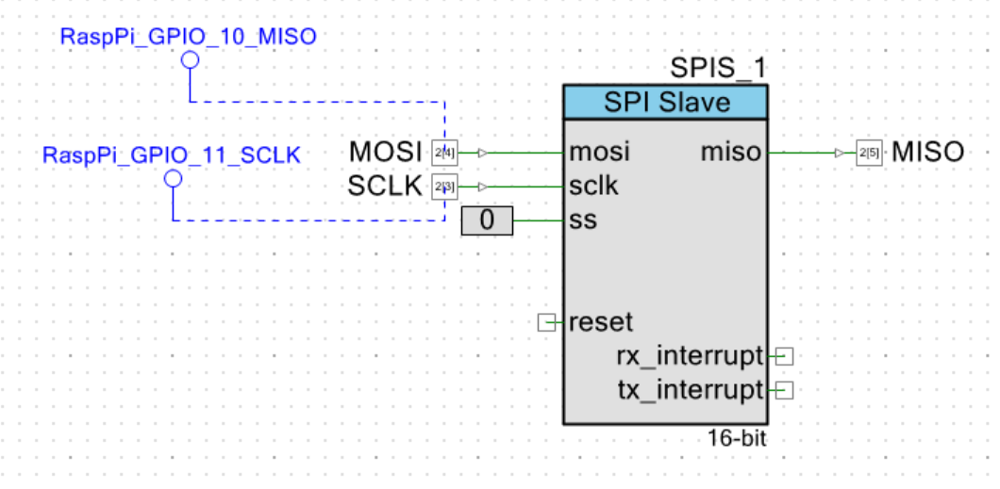

# Ball-In-Maze Solving Robot

## Summary

The Ball-in-Maze is a hand-eye coordination puzzle with the objective of manipulating a maze, usually by tilting it, to guide a ball towards a goal. This project aims to develop a vision-based maze-solving robot capable of autonomously controlling a ball within a maze. The system utilizes image processing, control techniques, and maze-solving algorithms for educational, recreational, and research purposes. The final product uses a 2-degree-of-freedom tilting platform, similar to a two-axis gimbal, to control the maze's orientation. A top-down camera accurately detects the ball's position and the maze layout. The system integrates a Raspberry Pi for high-level decision-making and PSOC microcontrollers for servo control. Path planning algorithms, such as RRT\*, generate optimal paths, while PID control is used to control the ball's movement. A web-based user interface allows for intuitive interaction and real-time monitoring. Users can initiate maze solving, monitor progress, and cancel operations as needed.

For the detailed explanations please refer to the full report.

## Table of Contents

- [Specifications and Approach](#specifications-and-approach)
- [Summary of work completed](#summary-of-work-completed)
  - [Research and Planning](#research-and-planning)
  - [Maze Puzzle Design](#maze-puzzle-design)
  - [Tilting Platform Design](#tilting-platform-design)
  - [Electrical Circuit Design](#electrical-circuit-design)
  - [Communication Protocols Raspberry Pi and PSOC](#communication-protocols-raspberry-pi-and-psoc)
  - [Communication Protocols PSOC and Dynamixel](#communication-protocols-psoc-and-dynamixel)
  - [Ball Localisation and Tracking](#ball-localisation-and-tracking)
  - [Maze Layout Detection](#maze-layout-detection)
  - [Path Planning](#path-planning)
  - [Control Systems](#control-systems)
  - [User Interface](#user-interface)
- [Findings](#findings)
  - [Final Bill of Materials (BOM)](#final-bill-of-materials-bom)
  - [Final Product](#final-product)
  - [Key features](#key-features)
  - [Testing and Results](#testing-and-results)
- [Conclusion](#conclusion)

<!-- TABLE OF CONTENTS -->

## Specifications and Approach

| Aspect | Approach and Specifications | Design Choice and Justification |
| --- | --- | --- |
| Camera Module | Utilize a camera module to capture RGB images of the maze environment, including the ball's position and maze layout. Choose based on resolution, frame rate, and compatibility | Raspberry Pi Camera Module chosen for its high-quality and high-speed image capture and compatibility with Raspberry Pi microcontroller. |
| Image Processing | Develop advanced algorithms for accurate ball detection and maze analysis. Optimize for real-time performance and computational efficiency. | Colour-based segmentation and adaptive thresholding for ball detection and maze layout detection. |
| Maze Solving Algorithm | Implement an efficient algorithm for determining the optimal path from current position to goal. Consider maze complexity and computational resources. | RRT\* selected for high speed and path guaranteed. |
| User Interface | Design a user-friendly GUI in Python to visualize robot progress, display information, and allow user interactions such as configuring goal position via the interface. | Flask chosen for simplicity and ease of web-based interface creation. |
| Control System | Develop sophisticated control algorithms using servo motors for precise movement and positioning of the ball within the maze. Aim for high accuracy in navigation. | Raspberry Pi for vision processing and PSOC for efficient servo communication. PID control for controlling the ball’s movement in the maze. |
| Servo | High-speed, high-accuracy servos to control the tilting platform precisely and quickly. | Dynamixel AX-12 chosen for its high-speed, high-accuracy performance. Important to note that supervisor Michael Zenere has prior experience working with these servos which will be helpful. |
| Safety Features | Incorporate safety mechanisms (e.g. hard limits and emergency stop) to prevent accidents. Ensure compliance with safety testing standards. | Angle limiting, emergency stop button, and ensuring the robot will not run when the ball isn’t present. |
| Cost-effectiveness | Optimize component selection and design to maintain project within budget of $150. Focus on affordability while meeting functional requirements. | University facilities used for cost-effective manufacturing including laser cutting and 3d printing services. Software-heavy design reduces hardware complexity and costs. |

## Summary of work completed

### Research and Planning

In the early stages of the project, thorough research and planning has been conducted. This process is important as it avoids wasting time, unnecessary expenses, and the need for redesigns.

### Maze Puzzle Design

Before designing the system, the specification of the Maze Puzzle design and construction had to be finalised. This ensures that the system can be successfully built around the specified maze design.

| Key Consideration | Approach |
| --- | --- |
| Interchangeable Mazes | The system is designed to accept any maze that meets the specified dimensions allowing for interchangeable mazes. |
| Standalone Playability | The mazes are also designed as standalone games, allowing for manual play. |
| Dimensions and Construction | The mazes are 15 cm by 15 cm squares made up of 2 layers of 3mm coloured acrylic sheet. This size is convenient for handheld games. The bottom layer is white, and the top layer is red to simplify colour segmentation. |
| Ball Selection | A 9mm black ceramic ball bearing is used. This size is cost-effective and suitable for the maze of this size. It is important to note, that the system is designed to detect and control all ball size that can fit on the Maze, but varying the ball size will require retuning of the PID controller. Hence, for the current scope of the project, a constant ball size will be used. |

### Tilting Platform Design

The design choice is a two-degree-of-freedom (2-DOF) tilting platform that allows controlled tilting along both the x and y axes. The servos are embedded in the frame similar to a 2-axis gimbal.

<table><tbody><tr><th>
Component
</th><th>
Construction, Functionality and Features
</th></tr><tr><td>
Base
</td><td>
Constructed from 6mm clear acrylic sheet. It has four corner holes with rubber feet for stability, and additional holes for servo mounts and brackets, all sized for M3 screws.
</td></tr><tr><td>
Servo Mount
</td><td>
Printed in ABS and attached to the base via M3 10mm screws and nuts. It features hexagon countersinks to lock the nut in place, ensuring a flush surface.
</td></tr><tr><td>
Brackets
</td><td>
Printed in ABS, these brackets serve as 90-degree joints for the supports, outer frame, inner frame, and camera mount. It also has hexagon countersinks to lock the nut in place, ensuring a flush surface.
</td></tr><tr><td>
Outer Frame
</td><td>
Constructed from four 6mm clear acrylic sheets, assembled with four brackets. Supported by the outer servo on one end and a bearing on the other, it tilts along the x-axis and supports the inner frame inside.
</td></tr><tr><td>
Inner Frame
</td><td>
Constructed from three stacked 3mm acrylic sheets. Attached to the inner servo on one end and to a shaft on a free-rotating bearing at the other end. The top acrylic layer acts as a border around the platform to snugly fit the maze, with openings on either side for easy removal or replacement.
</td></tr><tr><td>
Camera Mount
</td><td>
Constructed from two 3mm clear acrylic sheets mounted at 90 degrees via a bracket. The top plate has an opening with M2 holes to mount the camera facing down on the maze. It is directly connected to the inner frame, ensuring it remains perpendicular to the tilting platform, simplifying image processing. The total height from the Maze to the top of the camera mount is 16.5 cm, within the required height limit.
</td></tr><tr><td>
Miscellaneous
</td><td><ul><li>M3 and M2 bolts and nuts for all joints and connections</li><li>Bearings for smooth rotation along the x and y axes</li><li>Rubber feet to support the base</li></ul></td></tr></tbody></table>

### Electrical Circuit Design

Based on the design of the Tilting platform, the circuit diagram of the system was designed. The circuit diagram displays the interconnection of various electrical components within the maze-solving robot's system. It illustrates the power supply, signal paths, and connections between different input and output devices, providing an overview of the electrical layout. The system works by using a Raspberry Pi for high-level decision making and computer vision, and a PSOC for precise servo control, to tilt the platform and guide the ball through the maze based on visual feedback.

The power supply for the system is specified as 12VDC, 5A, 65W using a power adapter. This is justified based on the power consumption of the components: the Dynamixel servos, each drawing a maximum of 1.5A at 11.1V, and the Raspberry Pi, which draws up to 3A at 5V, with the PSOC drawing negligible current. The total current draw is calculated as follows.

This results in approximately 4.1A, which is well within the 5A capacity. Voltage regulators step down the 12V supply to 11.1V for the servos and 5V for the Raspberry Pi and PSOC, ensuring optimal operating voltages for all components.

The actuators used for the 2-degree-of-freedom (2-DOF) tilting platform are the Dynamixel 12AX servos. These servos are integral to the maze control system, offering high accuracy and precision.

| Specification | Details and Justification |
| --- | --- |
| Power Supply | 11.1V which matches the recommended voltage requirement for the Dynamixel 12AX servos. |
| Position Control | High resolution of 1024 steps, translating to 0.29° per step. This ensures precise tilting of the platform, which allows for minute adjustments when guiding the ball through the maze. |
| Speed | The no-load speed of 59 revolutions per minute at 12V ensures responsive platform adjustments for maze navigation. Given the system's design limits of ±20 degrees, the slowest transition time from -20 to 20 degrees is calculated as:  This speed is more than sufficient for the required movements. |
| Torque | Stall torque of 1.5 N.m at 12V and 1.5A. This offers adequate force to move the platform reliably under load conditions, maintaining control and stability. |
| Control Capabilities | Position control for precise platform angles, and velocity control for smooth motion. Enables the system to target specific angles and achieve controlled tilting speeds, ensuring smooth ball movement. |
| Communication | Half-duplex UART communication with the PSOC microcontroller. |
| Configuration | One servo for the inner frame and one for the outer frame |

For the main controller of the system, a combination of the PSOC controller and a Raspberry Pi 4 Model B is used. Both of these microcontrollers are excellent yet built for different purposes. The Table highlights the comparison of the capabilities of each microcontroller for various task relevant to this system.

| Task | Raspberry Pi | PSOC |
| --- | --- | --- |
| Computer Vision (Ball and Maze detection) | Good | Bad |
| Wi-Fi (Web-based User Interface) | Good | Bad (Requires External Module) |
| General Input Output | OK  | Very Good |
| Serial Communications (Communication with Servo) | Ok  | Very Good |

As seen, neither one microcontroller is the best choice for this system. Furthermore, even if a single microcontroller can perform all the required operations, the processing power may still be a concern. As such, the decision was made to distribute the task across the two microcontrollers. The Raspberry Pi will handle most of the high-level decisions and computer vision tasks while the PSOC will handle the servo control. This design is accomplished via a Master-Slave communication protocol via the SPI ports. For the vision-based task, the Raspberry Pi Camera Module V2 is used.

| Specification | Details |
| --- | --- |
| Weight | 3g  |
| Still Resolution | 8 Megapixels |
| Horizontal Field of View (FoV) | 62.2 degrees |
| Vertical Field of View (FoV) | 48.8 degrees |

### Communication Protocols Raspberry Pi and PSOC

The communication protocol used to communicate between the Raspberry Pi and PSOC is a Master Slave SPI protocol. The SPI is well suited for high-speed communications over 20 Mbps. It is simple in design requiring just 3 wires and a ground.

1. MOSI Master out slave in
2. MISO Master in slave out
3. Clock
4. Ground

In the scope of this project, the Raspberry Pi acts as the Master and the PSOC acts as the Slave. The data required to be sent is the target position of Servo 1 and Servo 2. Since the PSOC doesn’t need to send any information back to the Raspberry Pi, the MISO connection can be excluded. Below shows the pins connections used for the SPI Communication.

| Wire | Raspberry Pi 4 | PSOC 5 |
| --- | --- | --- |
| Clock | GPIO 11 (SCLK) | Pin 2\[4\] |
| MOSI | GPIO 10 (MOSI) | Pin 2\[3\] |
| Ground | GND | GND |

An important note to consider is that the Raspberry Pi operates at 3.3V, so the output voltage of the PSOC had to be adjusted from its default 5V to match. PSOC 5 features multiple VDDIO pins, each powering different ports.

| VDDIO | Port Pins |
| --- | --- |
| VDDIO0 | P0\[7:0\], P4\[7:0\], P12\[3:2\] |
| VDDIO1 | P1\[7:0\], P5\[7:0\], P12\[7:6\] |
| VDDIO2 | P2\[7:0\], P6\[7:0\], P12\[5:4\], P15\[5:4\] |
| VDDIO3 | P3\[7:0\], P12\[1:0\], P15\[3:0\] |
| VDDD | P15\[7:6\] (USB D+, D-) |

As such the value of VDDIO2 was set to 3.3V to match the raspberry Pi. The data being sent is the target position of each servo relative to its neutral position in steps (0 – 1024). A limit of 50 steps in either axis is set to prevent the platform from colliding with the base of the robot. The implementation involves a simple data transfer of 16 bits.

| Bits | Significance |
| --- | --- |
| 0-1 | 0b00 (Check Bit) |
| 2-7 | 5-bit Integer (Servo 1 Position) |
| 8-13 | 5-bit Integer (Servo 2 Position) |
| 14  | 0 for positive, 1 for negative (Servo 1 Sign) |
| 15  | 0 for positive, 1 for negative (Servo 2 Sign) |

Bits 0-1 act as a check bit (0b00), while bits 2-7 and 8-13 represent 5-bit integers for Servo 1 and Servo 2 positions, respectively. Bit 14 indicates the sign for Servo 1 (0 for positive, 1 for negative), and Bit 15 indicates the sign for Servo 2 in a similar manner. The data is transferred via two shift registers, in the Raspberry Pi and the PSOC 5 respectively. On every Clock pulse, 1 bit is shifted from the master to the slave, and this is repeatable until all the 16 bits have been sent. The bit rate used is 33 Mbps.

### Communication Protocols PSOC and Dynamixel

The PSOC connects to the Dynamixel servos through a TTL-level multi-drop bus using a half-duplex UART interface.

| Wire | Raspberry Pi 4 |
| --- | --- |
| Ground (GND) | Common Ground Reference |
| Power (VDD | 11.1V input from Power Rail |
| Data (DATA) | Pin 2\[0\] PSOC 5 |

To achieve half-duplex UART communication, the DATA pin functions as both a transmitter and receiver, sending and receiving packets to and from the servos. This is implemented by setting the pin as both a digital input as well as digital output.

The communication protocol implemented in the PSOC for controlling the Dynamixel servo motors involves a series of predefined instructions and packet structures. These instructions are used to send commands and read responses from the servos.

| Function | Description | Packet Structure |
| --- | --- | --- |
| LED_Control | Control the LED on the servo. | \[0xFF, 0xFF, ID, 4, 3, 25, Status, Checksum\] |
| Set_ID | Set a new ID for the servo. | \[0xFF, 0xFF, ID, 4, 3, 3, new_ID, Checksum\] |
| Move | Move the servo to a specified position. | \[0xFF, 0xFF, ID, 5, 3, 30, Position_L, Position_H, Checksum\] |
| MoveSpeed | Move the servo to a position at a specified speed. | \[0xFF, 0xFF, ID, 7, 3, 30, Position_L, Position_H, Speed_L, Speed_H, Checksum\] |
| TorqueStatus | Enable or disable the torque. | \[0xFF, 0xFF, ID, 4, 3, 24, Status, Checksum\] |
| SetReturnLevel | Set the status return level. | \[0xFF, 0xFF, ID, 4, 3, 16, level, Checksum\] |
| reset | Reset the servo to factory settings. | \[0xFF, 0xFF, ID, 2, 6, Checksum\] |
| ping | Ping the servo to check if it's online. | \[0xFF, 0xFF, ID, 2, 1, Checksum\] |
| MoveSpeedRW | Register a move command with speed for delayed execution. | \[0xFF, 0xFF, ID, 7, 4, 30, Position_L, Position_H, Speed_L, Speed_H, Checksum\] |
| action | Execute the registered move command. | \[0xFF, 0xFF, 254, 2, 5, 250\] |
| ReadVoltage | Read the current voltage from the servo. | \[0xFF, 0xFF, ID, 4, 2, 42, 1, Checksum\] |
| ReadTemperature | Read the current temperature from the servo. | \[0xFF, 0xFF, ID, 4, 2, 43, 1, Checksum\] |
| ReadPosition | Read the current position from the servo. | \[0xFF, 0xFF, ID, 4, 2, 36, 2, Checksum\] |
| ReadSpeed | Read the current speed from the servo. | \[0xFF, 0xFF, ID, 4, 2, 38, 2, Checksum\] |

The Packet fields include:

- ID: Identifier of the servo (0-253).
- Length: Length of the instruction packet.
- Instruction: Command to be executed (e.g., AX_WRITE_DATA, AX_READ_DATA).
- Parameters: Data specific to the instruction (e.g., position, speed).
- Checksum: Error-checking byte.

During integration with the entire system, the main function sets up UART and SPI communication, and controls the servos based on received SPI data. It continuously reads data from the SPI interface, processes it, and sends commands to the servos accordingly. Since the commands require an ID for each servo, the servos can be wired in daisy chain to simplify the wiring.

### Ball Localisation and Tracking

The system utilizes computer vision techniques on the image captured by the Raspberry Pi Camera to detect the ball position.

The image resolution is reduced to 200x200 pixels to increase capturing speed, averaging about 1 ms. This is adequate given the maze size of 15x15 cm and the ball size of 9 mm. No additional preprocessing is required since the camera is always perpendicular to the platform.

The ball is black, the floor is white, and the walls are red. Hence, the blue or green channel can be used to isolate the ball, avoiding the red channel to exclude the walls. The image undergoes Gaussian blur for smoothing and adaptive thresholding to generate a binary occupancy map.

Blob detection with 4-connectivity is performed. Next, aspect ratio and area-based filtering is performed to remove any falsely detected artifacts (if present). Finaly, the centre of the detected blob represents the ball's position, with the entire process taking less than 2 ms.

### Maze Layout Detection

The system begins by capturing an image from the Raspberry Pi Camera with downscaled resolution. Since the maze walls are red, the RED channel of the image is extracted. This isolates the walls from the rest of the scene.

Then a Gaussian blur is applied to the extracted RED channel to smoothen the image, reducing noise and minor variations. Next, adaptive thresholding is applied to the smoothed RED channel to generate a binary occupancy map. This process separates the maze walls (binary high) from the rest of the scene (binary low). Finaly, map Inflation applied to act as a buffer region between the ball and obstacles to increase the reliability that the path is safe and valid. The resulting binary occupancy map provides a clear distinction between the maze walls and the open paths, allowing for accurate navigation and control within the maze.

### Path Planning

1. The goal point was added to the head of the tree, initializing the RRT\* algorithm with the goal position as the first node. After initialisation, obstacles within a set radius around the ball position are removed. This prevents the ball from being mistakenly considered an obstacle during path planning.
2. A new node is then randomly generated within the valid region of the occupancy map. The nearest neighbour to this newly generated node is identified within the tree. The algorithm then checks if a direct path from the nearest node to the new node intersects any walls. If the path passes through an obstacle, the new node is discarded and the process of generating a new node is repeated.
3. If the path is obstacle-free, the new node is added to the tree and connected to the nearest node. The algorithm checks if the new node is close to the ball's current position. If the node is near the ball, the next step is to optimize the path. Otherwise, the algorithm continues generating new nodes.
4. Path optimization involves re-evaluating the parent nodes of each node within a specified radius to minimize the overall path cost. The result is an optimized path from the start position to the goal position, which avoids obstacles and minimizes the path length.

The number of Iterations, N, determines how many iterations the RRT\* algorithm will perform during its execution. A higher value of N signifies more iterations, allowing for greater exploration of the search space. However, this also results in higher computational time due to the increased number of node expansions and path optimizations.

The “Stop When Reached” flag is a feature implemented to halt as soon as a valid path to the goal is found. If the algorithm successfully finds a path, it terminates immediately, regardless of the total number of iterations specified.

This approach offers several benefits. By stopping when a path is found, the algorithm saves computation time, particularly for straightforward paths. Users experience shorter wait times, enhancing usability. Despite stopping early for simple paths, the algorithm remains capable of finding more complicated routes ensuring it can handle diverse path requirements.

The goal position is set as the head of the tree instead of the ball’s position to ensure that the tree converges on the goal. This allows for recalculating the path to the same goal position using the existing tree if the ball deviates from its preplanned path. Furthermore, the RRT\* algorithm, with its inherent probabilistic completeness, guarantees that it will find a path to the goal given sufficient time and a feasible path. This property assures users that, with appropriate settings, the algorithm can reliably navigate various environments and obstacles.

### Control Systems

The overview of the control loop to solve the maze is highlighted in the following steps.

1. The system obtains the series of waypoints from the planned path. The initial waypoint is set as the target ball position.
2. Ball position is detected. If the ball is not detected, the system returns to a neutral state and waits. This feature ensures safety and allows for dynamic adjustments to the ball's position without disrupting the system. The system quickly recalculates the route using the existing tree when the ball is detected again.
3. Using the balls position, the system calculates the error between the current position and the target waypoint.
    1. If the error is below a threshold, the system shifts to the next waypoint.
    2. If the current waypoint is the last one, the system slowly returns the platform to a neutral flat position, indicating the goal is reached.
    3. In rare cases where the error exceeds a predefined threshold, indicating a significant deviation from the path, the system uses the existing tree to recalculate the path. This process is very fast since it utilizes the existing tree structure and nodes, ensuring efficient path correction. Waypoints are updated based on the recalculated path.
4. Based on the error calculated, a PID (Proportional-Integral-Derivative) control is used to determine the target servo position for both X and Y axes independently. The target servo position is then sent to the PSOC via SPI communication to control the servos.
5. This loop is repeated until the ball reaches the goal position or is cancelled by the User via the user interface.

### User Interface

The graphical user interface is created as a Web-Based Interface using Flask, a Python web framework, along with HTML, CSS, and JavaScript. Being web-based, the system can be accessed from devices connected to the same Wi-Fi network, such as phones, laptops or any external device connected to Wi-Fi. The interface is designed to be intuitive and user-friendly, enhancing the user experience.

| Feature            | Functionality                                                                                                                                                                                                                   |
|--------------------|---------------------------------------------------------------------------------------------------------------------------------------------------------------------------------------------------------------------------------|
| Live Video Feed    | Provides a live video feed from the camera at 30 frames per second (fps) for real-time monitoring. Users can click anywhere on the screen to select the goal position, ensuring ease of interaction.                               |
| Status Display     | Indicates that the system is ready and waiting for user input.                                                                                                                                                                  |
| No Ball Detected   | Alerts the user when no ball is detected in the maze, preventing the system from proceeding without the required input.                                                                                                       |
| Generating Path    | The system is calculating the optimal path based on the selected goal position.                                                                                                                                                 |
| Plotting Path      | Displays the calculated path overlaying the live video feed, providing users with a visual representation of the planned route.                                                                                                 |
| Solving Maze       | The system is actively controlling the ball to navigate through the maze towards the goal position. Users can observe the live movement of the ball as it progresses towards the goal.                                       |
| Reached Goal       | Indicates when the ball successfully reaches the goal position, marking the completion of the maze-solving task.                                                                                                                                |
| Generate Path      | Generates the optimal path based on the selected goal position using the RRT\* algorithm.                                                                                                                                        |
| Solve              | Initiates the maze-solving process by controlling the ball to navigate towards the goal position.                                                                                                                               |
| Cancel Run         | Allows the user to cancel the current operation or run, providing an option to stop the maze-solving process if needed.                                                                                                         |

## Findings

### Final Bill of Materials (BOM)

The BOM is essential for project management, budgeting, and procurement. It provides a clear overview of the project's material and cost requirements. Most components are sourced from the same supplier, simplifying logistics. The system was designed to be more software driven to reduce the number of physical parts needed, hence lowering the overall cost.

The BOM includes all materials, components, and resources needed for the "Ball-in-Maze Solving Robot," detailing each item's source, product ID, unit, quantity, unit cost, and total cost.

| No  | Part Name | Source | Product ID | Unit | Quantity | Unit cost ($AUD) | Cost ($AUD) |
| --- | --- | --- | --- | --- | --- | --- | --- |
| 1   | Arduino Compatible DC Voltage Regulator Module | Jaycar Electronics | XC4514 | each | 2   | 10.25 | 20.5 |
| 2   | 2.1mm DC Plug with Screw Terminals | Jaycar Electronics | PA3711 | each | 1   | 7.95 | 7.95 |
| 3   | 12VDC 5A 65W Switch mode Mains Adaptor with 7 Changeable Plugs | Jaycar Electronics | MP3560 | each | 1   | 69.95 | 69.95 |
| 4   | M3 x 10mm Steel Screws - Pack of 25 | Jaycar Electronics | HP0403 | each | 1   | 3.55 | 3.55 |
| 5   | M3 x 6mm Steel Screws - Pack of 25 | Jaycar Electronics | HP0400 | each | 1   | 3.15 | 3.15 |
| 6   | M3 Steel Nuts - Pack of 25 | Jaycar Electronics | HP0425 | each | 1   | 3.70 | 3.70 |
| 7   | 608RS Carbon Steel Bearing 10 Pack | Jaycar Electronics | YG2950 | each | 1   | 13.95 | 13.95 |
| 8   | Si3N4 Ceramic Ball GR.5 Black Colour, 9mm | AU Miniature Bearings | 389530507 | each | 1   | 3.8 | 3.8 |
| 9   | Raspberry Pi 4 Model B Board | Monash | \-  | each | 1   | 0   | 0   |
| 10  | PSoC™ 5LP CY8CKIT-059 | Monash | \-  | each | 1   | 0   | 0   |
| 11  | Raspberry Pi Camera Module V2 (Including Mounting Screws) | Monash | \-  | each | 1   | 0   | 0   |
| 12  | Dynamixel AX-12 Servo (Including Mounting Screws) | Monash | \-  | each | 2   | 0   | 0   |
| 13  | Wires and Connectors | Monash | \-  | \-  | \-  | 0   | 0   |
| 14  | 3mm Clear Acrylic sheet | Monash | \-  | m2 | 0.08 | 0   | 0   |
| 15  | 3mm White Acrylic sheet | Monash | \-  | m2 | 0.0225 | 0   | 0   |
| 16  | 3mm Red Acrylic sheet | Monash | \-  | m2 | 0.135 | 0   | 0   |
| 17  | 6mm Clear Acrylic sheet | Monash | \-  | m2 | 0.2 | 0   | 0   |
| 18  | ABS (white) | Monash | \-  | g   | 50  | 0   | 0   |
|     |     |     |     |     |     | **Total** | **126.55** |

Therefore, the total cost of the project, at **126.55 AUD**, is well within the budget of 150 AUD. Most components are sourced from the same supplier, which simplifies procurement. Additionally, the project utilizes university facilities such as 3D printing and laser cutting to save costs.

### Final Product

The final product is an autonomous maze-solving robot system designed with meticulous planning and research. Key components include interchangeable maze puzzles, a tilting platform with precise servo control, and simple electrical circuitry powered by a 12VDC, 5A power supply from a wall adapter.

The system integrates Raspberry Pi and PSOC microcontrollers for high-level decision-making and servo control, respectively. Communication protocols like SPI and UART facilitate efficient data exchange between components.

Computer vision capabilities, driven by the Raspberry Pi Camera Module V2, accurately detect the ball's position and maze layout. Path planning algorithms, such as RRT\*, generate optimal paths while PID control ensures precise servo positioning.

The web-based user interface, developed using Flask and HTML/CSS/JavaScript, offers intuitive interaction and real-time monitoring. Users can initiate maze solving, monitor progress, and cancel operations as needed.

Overall, the system represents the integration of computer vision, path planning, and control systems to create an autonomous maze-solving robot.

### Key features

**Modularity and User Experience:**

The system features Interchangeable Maze Designs. The system is designed to accept any maze configuration as long as the walls are red, and the dimensions are 15cm by 15cm by 3mm. The interchangeable design promotes creativity, allowing users to design and test their own maze configurations. This modular approach enhances user engagement and provides flexibility in testing different maze designs without hardware modifications.

**Safety Mechanisms:**

The system includes hard limits on the angles to prevent excessive tilting, ensuring the ball does not fall off the platform and preventing the platform from colliding into the base.

The system also automatically stops solving the maze if the ball is removed from the platform. It will resume solving if the ball is placed back on the platform at any position, ensuring seamless continuation of the maze-solving process.

**Minimal Design:**

The system uses a straightforward circuit design with minimal wiring, only three signal wires (SPI_CLK, SPI_MOSI, UART_DATA) in addition to power and ground connections. Hence, the design emphasizes software over hardware. This approach reduces costs by minimizing the number of physical components required. The simplicity of the circuit design makes the system easier to maintain and modify, supporting long-term usability and adaptability.

### Testing and Results

To ensure the consistency and reliability of the autonomous ball in maze solving robot system, rigorous testing was conducted across various conditions and scenarios. The testing process included ball detection, maze layout detection, path planning and maze solving.

**Ball Detection Testing:**

Ball detection capabilities were evaluated under different lighting conditions and random platform orientations. The testing involved 20 runs each for scenarios with and without the ball, assessing the system's ability to accurately detect the ball.

| Lighting Condition                                         | With Ball                                | Without Ball                             |
|------------------------------------------------------------|------------------------------------------|------------------------------------------|
| ---                                                        | Ball Detected Correctly (True Detection) | Ball Detected Incorrectly (False Detection) |
| Controlled Lighting (Robotics Lab)                          | 100%                                     | 0%                                       |
| Indoor Lighting (Sir Louis Matheson Library)                | 100%                                     | 5%                                       |
| Outdoor Lighting (Monash Clayton Campus Outdoor Bench)      | 65%                                      | 10%                                      |
| ---                                                        | No Ball Detected (False Detection)       | No Ball Detected (True Detection)        |
| Controlled Lighting (Robotics Lab)                          | 0%                                       | 100%                                     |
| Indoor Lighting (Sir Louis Matheson Library)                | 0%                                       | 100%                                     |
| Outdoor Lighting (Monash Clayton Campus Outdoor Bench)      | 25%                                      | 70%                                      |

The results indicate good ball detection performance under controlled and indoor lighting conditions. However, outdoor lighting poses challenges, with reduced accuracy due to environmental factors. It is important to note that outdoor lighting is limited to areas with wall outlets which is a limitation and will be addressed.

**Maze Layout Detection Testing:**

The maze layout detection algorithm was tested to ensure accurate identification of maze configurations. Correct layout was assessed against predefined designs. False detection includes occluded paths or incorrect patches of wall or empty space. The testing involved 20 runs each.

| Lighting Condition | True Detection | False Detection |
| --- | --- | --- |
| Controlled Lighting (Robotics Lab) | 100% | 0%  |
| Indoor Lighting (Sir Louis Matheson Library) | 100% | 0%  |
| Outdoor Lighting (Monash Clayton Campus Outdoor Bench with power outlet) | 50% | 50% |

The system demonstrates high accuracy in maze layout detection under controlled and indoor lighting conditions. However, outdoor lighting impacts detection accuracy.

Moving forward, all tests will be conducted under indoor lighting conditions, the intended use-case scenario, to ensure consistent performance.

**Path Planning Testing:**

Path planning performance was evaluated by measuring average time taken to generate a path for different start and goal positions across three different maze designs: simple path, grid-based maze, and radial maze. The path planner (RRT\*) was configured to use "Stopped when reached" flag with 20000 iterations. The testing involved 10 runs.

| Maze Design | Average Time (s) |
| --- | --- |
| Simple Path | 15  |
| Grid-based | 30  |
| Radial | 25  |

The system achieves satisfactory path planning results, with average times ranging from 15 to 30 seconds across different maze designs. Nevertheless, it achieved 100% success rate in generating a feasible path.

**Maze Solving Testing:**

Each maze design was tested 10 times. The average time for maze solving and the number of runs requiring rerouting were recorded.

| Maze Design | Average Time (minutes) | Rerouting Required (out of 10 runs) |
| --- | --- | --- |
| Simple Path | 1   | 0   |
| Grid-based | 2.5 | 5   |
| Radial | 2   | 4   |

Longer solving times and rerouting instances suggest potential limitations in the controller design, impacting real-time responsiveness. Despite longer durations, the system achieved a 100% success rate in maze solving across all designs. Addressing controller design inefficiencies could improve overall performance and reduce solving time.

# Conclusion

In conclusion, this project successfully developed an autonomous maze-solving robot system that integrates computer vision, path planning, and control mechanisms to navigate a ball through various maze designs. Through design and testing, the system demonstrated high reliability achieving a 100% success rate in maze-solving tasks.

| No. | Objective | Achievement |
| --- | --- | --- |
| 1   | Develop a vision-based control system using advanced image processing to detect the ball's position and maze configuration in real-time. | The system achieved over 95% accuracy in controlled and indoor lighting conditions, successfully detecting the ball and maze configuration in less than 2ms. |
| 2   | Implement sophisticated control algorithms to achieve precise movement and positioning of the ball within the maze. | The implemented PID control that ensured the ball consistently reached the goal within the specified tolerance of 5 mm |
| 3   | Ensure the robot can handle mazes with intricate designs and varying levels of complexity and adapt to dynamic environments. | The robot successfully solved mazes of varying complexity, including simple paths, grid-based mazes, and radial designs with 100% solve rate |
| 4   | Create a graphical user interface (GUI) for real-time visualization of the robot's progress and state. | The web-based user interface offers intuitive interaction and real-time monitoring. |
| 5   | Implement safety features to prevent accidents or damage during the robot’s operation. | Comprehensive safety features were implemented and successfully tested, preventing excessive tilting and allowing for seamless continuation after ball removal |
| 6   | Focus on making the robot cost-effective without compromising functionality and performance. | The project maintained a cost under AUD 150, ensuring all functional and performance requirements were met |

Other key accomplishments include:

- Modularity and User Engagement: The interchangeable maze design promotes user creativity and engagement, allowing for diverse testing scenarios without hardware modifications.
- Simplified Design: The minimalistic circuit design emphasizes software solutions, reducing costs and enhancing the system's adaptability for future improvements.

Despite the project's success, several areas for improvement were identified.

- The current PID controller exhibited limitations in complex scenarios leading to higher solving times and occasional path deviations. Implementing more advanced control algorithms, such as Model Predictive Control (MPC), could enhance the system's responsiveness and accuracy.
- Enhancing the system's portability with a battery pack and a foldable camera mount would increase its practicality for real-world applications.

Overall, this project successfully designed and prototyped a flexible and user-friendly autonomous ball in maze solving robot. It shows potential for further improvements, such as more sophisticated controllers and portable designs.